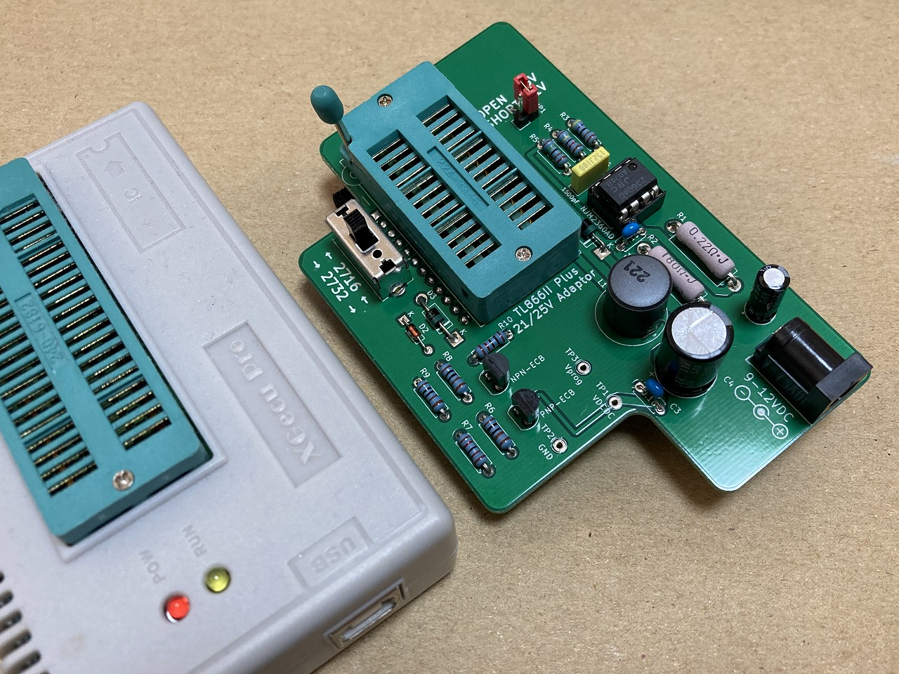
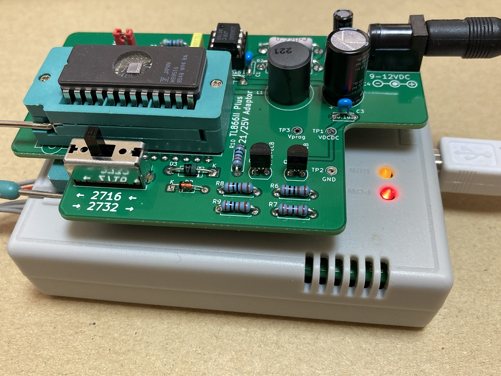
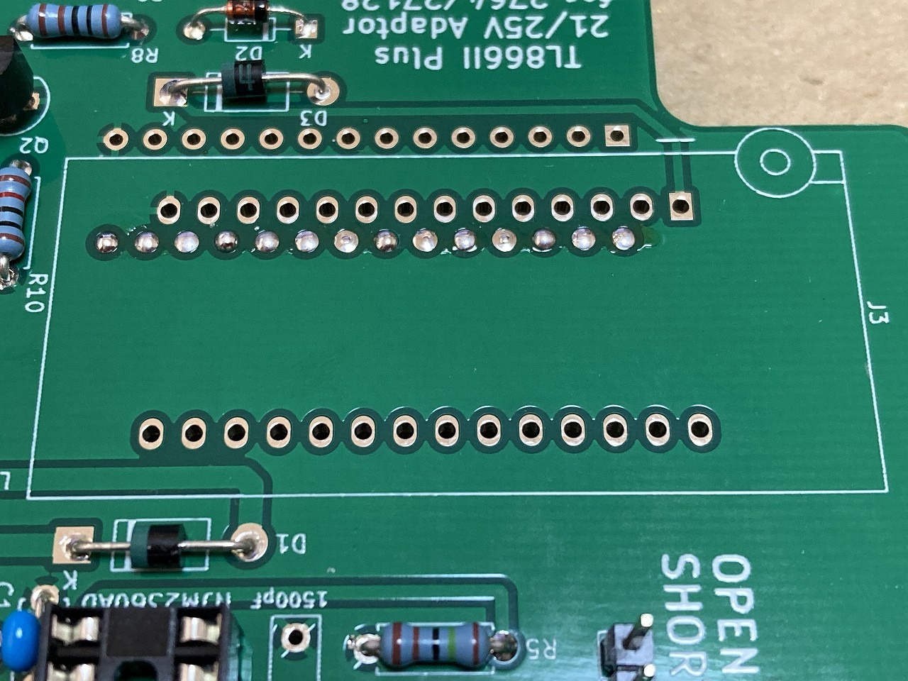
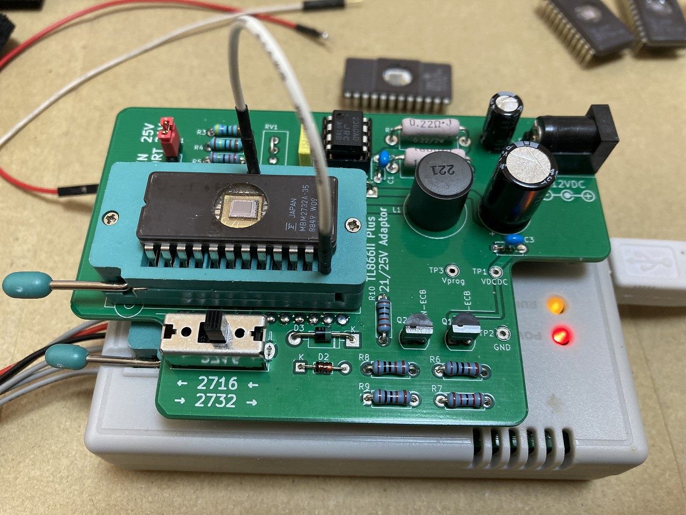
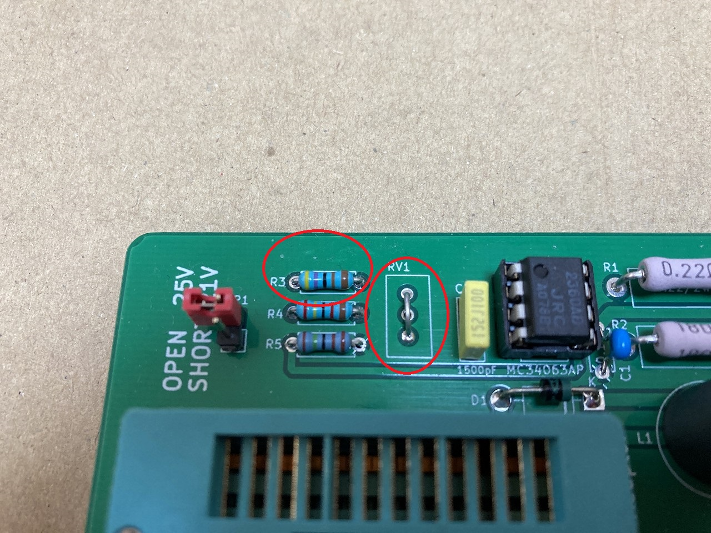
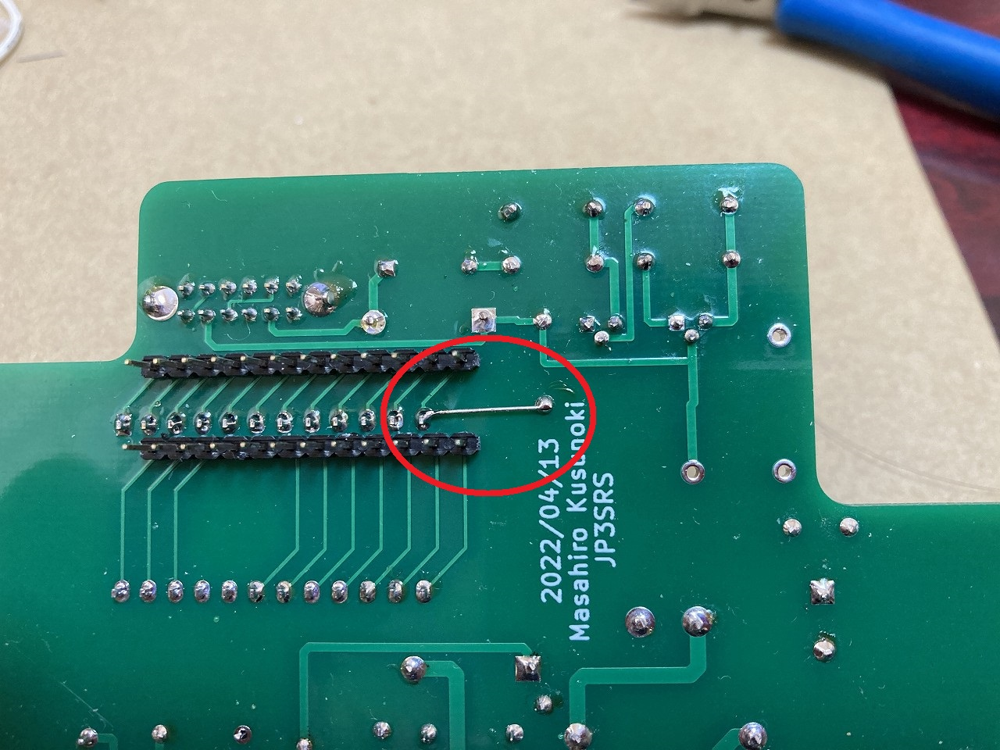

# TL866II PLUS 25V/21V アダプター

## 概要
当アダプタは XGecu TL866II PLUS プログラマにて 2716/2732 UV-EPROM 書き込みのための 25V/21V を供給するサポートアダプターです。TL866II PLUS の書き込み電圧 18V を検出すると ROM の VPP ピンに 25V/21V を供給します。

基板とスライドスイッチは https://www.em9system.com/?p=965 にて頒布いたします。

## 部品表
本来は部品の種類別にソートするものですが、購入先別に分けて記載しています。

|部品番号|部品名|URL|数量|備考|
|----|----|----|----|----|
|U1|DCDCコンバーター制御用IC NJM2360AD|https://akizukidenshi.com/catalog/g/gI-12365/|1|MC34063A も使えます|
|U1|丸ピンICソケット ( 8P)|https://akizukidenshi.com/catalog/g/gP-00035/|1|
|Q1|トランジスタ 2SA733L-K-T92-K 60V150mA|https://akizukidenshi.com/catalog/g/gI-11428/|1|TO-92ECB 手持ちの 2SA1015 などもOK|
|Q2|トランジスタ 2SC945L-K-T92-K 60V150mA|https://akizukidenshi.com/catalog/g/gI-11428/|1|TO-92ECB 手持ちの 2SC1815 などもOK|
|D1,D3|ショットキーバリアダイオード 40V1A 11EQS04|https://akizukidenshi.com/catalog/g/gI-11363/|2|
|D2|定電圧ダイオード(ツェナーダイオード) 15V500mW GDZJ15C|https://akizukidenshi.com/catalog/g/gI-07498/|1|DO-34|
|C5|メタライズドポリエステルフィルムコンデンサ 1500pF100V|https://akizukidenshi.com/catalog/g/gP-14588/|1||7.5mm×6.5mm×2.5mm ピッチ5mm|
|L1|インダクター 220μH0.75A SRC1013|https://akizukidenshi.com/catalog/g/gP-16012/|1|11x12.5 ピッチ5mm|
|J1|2.1mm標準DCジャック(4A) 基板取付用 MJ-179PH|https://akizukidenshi.com/catalog/g/gC-06568/|1|
|J2|細ピンヘッダ 1×40 (黒)|https://akizukidenshi.com/catalog/g/gC-06631/|1|
|J3|ゼロプレッシャーICソケット 24P 600mil|https://akizukidenshi.com/catalog/g/gP-12077/|1|
|JP1|ジャンパーピン赤(2.54mmピッチ)(25個入)|https://akizukidenshi.com/catalog/g/gP-03688/|1|
|R1|小形金属皮膜抵抗(MOSX)2W 0.22Ω【MOSX2CR22J】 |https://www.marutsu.co.jp/pc/i/18085/|1|L=15mm D=4mm|
|R2|【MOS2C181J】小型酸金抵抗(MOS)2W 180Ω|https://www.marutsu.co.jp/pc/i/18155/|1|L=15mm D=4mm|
|R3|1/4W金属皮膜抵抗 4.7kΩ 黄紫黒茶茶【MF1/4CC4701F】 |https://www.marutsu.co.jp/pc/i/1313/|1|L=7.1mm D=2.3mm|
|R4|1/4W金属皮膜抵抗 24kΩ 赤黄黒赤茶【MF1/4CC2402F】 |https://www.marutsu.co.jp/pc/i/1283/|1|L=7.1mm D=2.3mm|
|R5|1/4W金属皮膜抵抗 1.5kΩ 茶緑黒茶茶【MF1/4CC1501F】|https://www.marutsu.co.jp/pc/i/1248/|1|L=7.1mm D=2.3mm|
|R6,R8,R9|1/4W金属皮膜抵抗 1kΩ 茶黒黒茶茶【MF1/4CC1001F】|https://www.marutsu.co.jp/pc/i/1263/|3|L=7.1mm D=2.3mm|
|R7|1/4W金属皮膜抵抗 12kΩ 茶赤黒赤茶【MF1/4CC1202F】|https://www.marutsu.co.jp/pc/i/1253/|1|L=7.1mm D=2.3mm|
|R10|1/4W金属皮膜抵抗 10kΩ 茶黒黒赤茶【MF1/4CC1002F】|https://www.marutsu.co.jp/pc/i/1251/|1|L=7.1mm D=2.3mm|
|C1,C3|【RDER71H104K0K1H03B】セラミックコンデンサ 0.1UF 50V X7R ラジアル|https://www.marutsu.co.jp/pc/i/834991/|2|4mmx2.5mm ピッチ5mm|
|C2|小形アルミニウム電解コンデンサー25V 100μF【25PK100MEFC】|https://www.marutsu.co.jp/pc/i/132144/|1|D=5mm ピッチ2mm|
|C4|小形アルミニウム電解コンデンサー50V 330μF【50PK330MEFC】|https://www.marutsu.co.jp/pc/i/132162/|1|D=10 ピッチ5mm|
|JP1|2ピン基板用ピンヘッダー[2ピン×1列]【2130S1*2GSE】 |https://www.marutsu.co.jp/pc/i/590531/|1|
||SSSF040800 ALPS ALPINE スライドスイッチ|https://www.chip1stop.com/product/detail?partId=ALPS-0000163|1|4PDT スライドスイッチ 頒布品を買われた方は購入不要|
||プリント基板||1|頒布品を買われた方は基板製造不要|

- R1, R2 は 2W サイズと大きいものを選定していますが、ROM のプログラミングだけでこのワット数は不要です。しかしながらこの回路を参考にされて電流を取り出す用途に流用された時は、発熱の可能性があるためマージンを取った形にしています。
- Q1, Q2 汎用でいいのですが、秋月だと10個単位とかになってしまうので1個単位で買えるトランジスタを選定しています。
- 1/4W 抵抗のうち、R3, R4, R5 は DC/DC チップの基準電圧用なので金属皮膜 1% を使用して下さい。それ以外の抵抗は 5% カーボンでも問題ありません。これも通販だと 10本/100本単位がほとんどなので1本単位で購入出来るものにしています。

## 回路図
リポジトリにある schematic-nnnnnn.pdf (nnnnnnは日付) を参照下さい。

## ガーバーファイル
リポジトリにある gaeber-nnnnnn.zip (nnnnnnは日付) を参照下さい。

## 組み立て時の注意
**ZIF ソケットをハンダ付けする前に細ピンヘッダを先にハンダ付けしてください。** これ以外は特に取り付け順はありません。

下の写真は、別バージョンの基板ですが、ZIF ソケットに隠れる細ピンヘッダを先に半田付けしているところ。

## 書き込み実績
手持ちが少ないですが以下の ROM 書き込み出来ました。
- NEC D2716D(25V)
- MITSUBISHI M5L2716K(25V)
- FUJITSU MB8516(25V)
- FUJITSU MBM2732A(21V)
- INTEL D2732A-3(21V)
- TOSHIBA TMM2732D(25V)
- MITSUBISHI M5L2732K(25V)
- HITACHI HN482732AG(21V)

## 書き込み方法
- アダプタを TL866II PLUS のソケットに装着する
- ROM の書き込み電圧に合わせて 25V はジャンパを外す 21V ならジャンパ装着する
- スライドスイッチを 2716/2732 に合わせる
- 9～12V の ACアダプタを挿して電源を入れる。
- XGpro アプリケーションを起動しチップの選択をします。
- 画面左下の [Pin Detect] のチェックボックスを外す

- READ ボタンを押してエラーないことを確認
- HEX ファイルを LOAD する
- WRITE ボタンを押して書き込む
- 書き込み不調の場合は Pulse Delay を最大 1000us にするといけることがあります。

## 2732 書き込み時の注意点

2732 の書き込みは XGpro v11.90 のバージョンではエラーになります。次の写真のように 2732 18Pin CE（チップイネーブル）を 12pPin GND にジャンパして強制的に CE 有効にして書き込みを行ってください。これはアプリケーションの不具合で現状これ以外のワークアラウンドは無い模様です。

## ~~rel 2022/04/13 基板作成時の変更点~~
~~初版の基板にはエラーがあります。R3 3.6k のシルク間違いと半固定抵抗の配線ミスと GND 配線忘れです。~~
- ~~R3 はシルク印刷 3.6k ですが実装は 4.7k です。~~
- ~~半固定抵抗は抵抗の余りリード線を使ってショートします~~
- ~~ZIF ソケットの 12 ピンと GND を抵抗の余りリード線を使ってショートします~~

